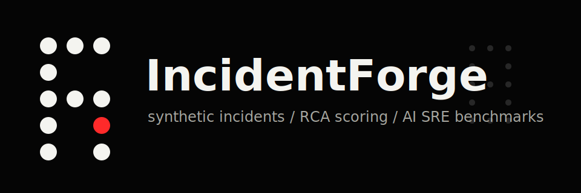
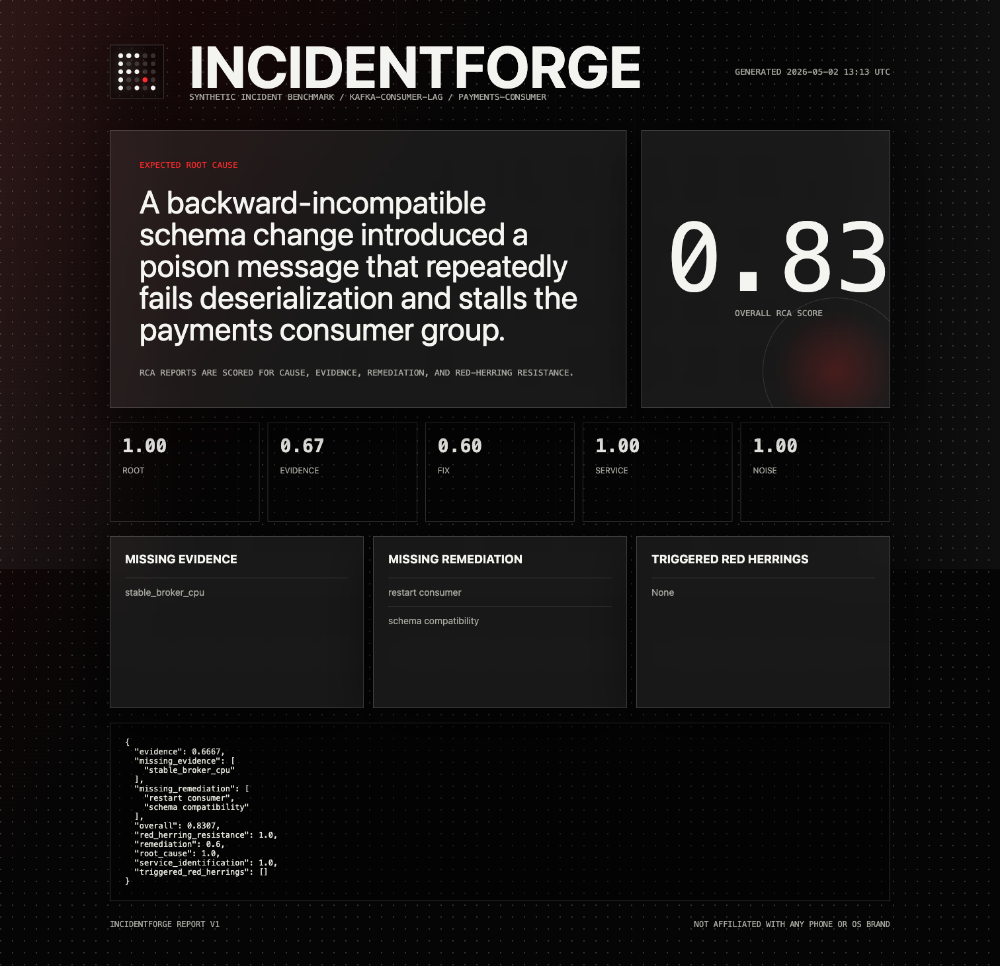
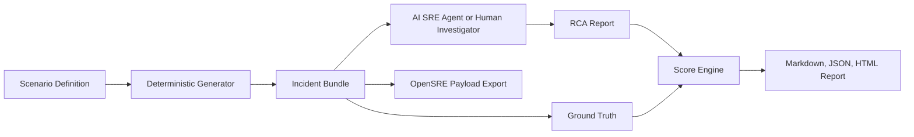

<p align="center">
  
</p>

<p align="center">
  
  <a href="LICENSE"></a>
  
</p>

# IncidentForge

IncidentForge is an open-source toolkit for generating synthetic production incidents
and scoring root-cause analysis reports from AI SRE agents.

It is built for engineers who want realistic incident fixtures without standing up a
full production stack. Generate an incident bundle, hand it to an agent, then score
the agent's RCA against ground truth for root cause, evidence, remediation, and
red-herring resistance.

The visual system uses a monochrome, dot-matrix, transparent-panel aesthetic inspired
by industrial product interfaces. It is not affiliated with Nothing Technology Ltd.

<p align="center">
  
</p>

## Why This Exists

AI agents for production engineering need better evaluation data. Real incidents are
sensitive, expensive, and messy. Toy incidents are too shallow. IncidentForge sits in
the middle: deterministic, inspectable incident bundles with enough noise to test
whether an AI SRE agent can investigate rather than hallucinate.

Each generated bundle includes:

- `alert.json` - production-style alert metadata
- `metrics.csv` - time-series evidence and impact signals
- `logs.jsonl` - service logs, causal events, and red herrings
- `traces.json` - simplified distributed trace spans
- `runbook.md` - operator-facing investigation guidance
- `ground_truth.json` - scoring truth for automated evaluation
- `candidate_rca.md` - a baseline report you can score immediately

## Quick Start

```bash
git clone https://github.com/MohamadKanso/IncidentForge
cd IncidentForge
python3 -m pip install -e ".[dev]"
incidentforge demo --out examples/demo
open examples/demo/report.html
```

Score the bundled candidate RCA:

```bash
incidentforge score \
  --report examples/demo/bundle/candidate_rca.md \
  --truth examples/demo/bundle/ground_truth.json \
  --html examples/demo/report.html \
  --json examples/demo/score.json
```

Export an OpenSRE-style alert payload:

```bash
incidentforge replay examples/demo/bundle \
  --target opensre \
  --out examples/demo/opensre_alert.json
```

## CLI

```bash
incidentforge list
incidentforge generate kafka-consumer-lag --out outputs/kafka --seed 42
incidentforge inspect outputs/kafka
incidentforge score --report outputs/kafka/candidate_rca.md --truth outputs/kafka/ground_truth.json
incidentforge history --db outputs/incidentforge.sqlite
```

## Built-In Scenarios

| Scenario | System | What it tests |
| --- | --- | --- |
| `kafka-consumer-lag` | Kafka and schema registry | Poison messages, lag analysis, schema compatibility |
| `postgres-connection-exhaustion` | API and Postgres | Pool saturation, retry leaks, false infra leads |
| `airflow-dag-backfill-storm` | Airflow | Scheduler backlogs, deployment config, downstream impact |
| `redis-memory-fragmentation` | Redis | Memory fragmentation, eviction pressure, cache miss impact |

## Scoring Model

IncidentForge scores RCA reports across five dimensions:

| Dimension | Weight | Question |
| --- | ---: | --- |
| Root cause | 42% | Did the report identify the actual failure mode? |
| Evidence | 34% | Did it cite the required metrics, logs, or traces? |
| Remediation | 14% | Did it propose the right operational fix? |
| Service identification | 10% | Did it name the affected service? |
| Red-herring resistance | penalty | Did it incorrectly blame misleading signals? |

The scorer is intentionally transparent. It uses phrase and token matching against
ground-truth terms so contributors can inspect, tune, and debate evaluation behavior
without needing an LLM judge.

## Architecture



## Design Language

The generated HTML report is designed like a piece of production hardware:

- black and white core palette with a single red fault signal
- exposed structure through transparent panels and grid rails
- dot-matrix identity marks instead of decorative illustrations
- dense but readable operator data
- no marketing fluff in the report surface

See [docs/design-system.md](docs/design-system.md) for the design notes.

## Development

```bash
python3 -m pip install -e ".[dev]"
python3 -m pytest
python3 -m ruff check incidentforge tests
```

The runtime package uses the Python standard library only. `pytest` and `ruff` are
development dependencies.

A GitHub Actions workflow template lives at
[`docs/ci/github-actions-ci.yml`](docs/ci/github-actions-ci.yml). Copy it to
`.github/workflows/ci.yml` once your GitHub token has `workflow` scope enabled.

## Roadmap

- Add OpenTelemetry span generation
- Add ClickHouse-backed benchmark history
- Add LangGraph evaluator workflow
- Add Grafana/Loki docker-compose demo
- Add scenario contribution validator
- Add optional LLM-as-judge comparison mode
- Add Rust log mutation engine for high-volume fixture generation

## Contributing

Contributions are welcome. Good first contributions include:

- adding a new scenario pack
- improving the scorer for synonyms and partial evidence
- adding exporters for Datadog, Grafana, PagerDuty, or OpenSRE
- improving documentation and example RCA reports

Read [CONTRIBUTING.md](CONTRIBUTING.md) before opening a pull request.

## License

Apache-2.0. See [LICENSE](LICENSE).
