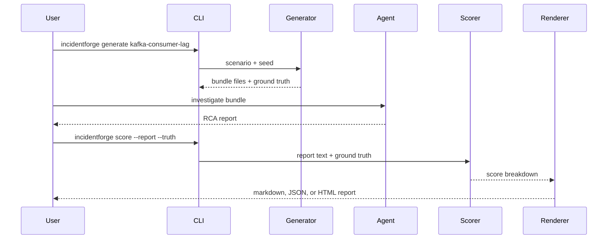

# Architecture

IncidentForge is intentionally small, inspectable, and dependency-light. The goal is
to make synthetic incident evaluation easy to understand before adding heavier
systems such as LangGraph, ClickHouse, or OpenTelemetry.

## Components

| Component | Path | Responsibility |
| --- | --- | --- |
| Scenario catalog | `incidentforge/scenarios.py` | Defines root causes, evidence, red herrings, and remediation terms |
| Generator | `incidentforge/generator.py` | Turns a scenario into deterministic logs, metrics, traces, alert metadata, and ground truth |
| Scorer | `incidentforge/scoring.py` | Scores RCA text against transparent ground-truth terms |
| Renderer | `incidentforge/render.py` | Writes markdown and premium HTML score reports |
| Exporters | `incidentforge/exporters.py` | Converts bundles into external tool payloads |
| Storage | `incidentforge/storage.py` | Records local SQLite score history |
| CLI | `incidentforge/cli.py` | Provides the public workflow |

## Data Flow

## Design Principles

- Deterministic fixtures are easier to debug than generated black boxes.
- Ground truth should be plain JSON so it can be reviewed in code review.
- Red herrings should be explicit, not accidental noise.
- Scoring should be transparent before it becomes intelligent.
- Generated reports should feel like operator tooling, not a marketing page.

